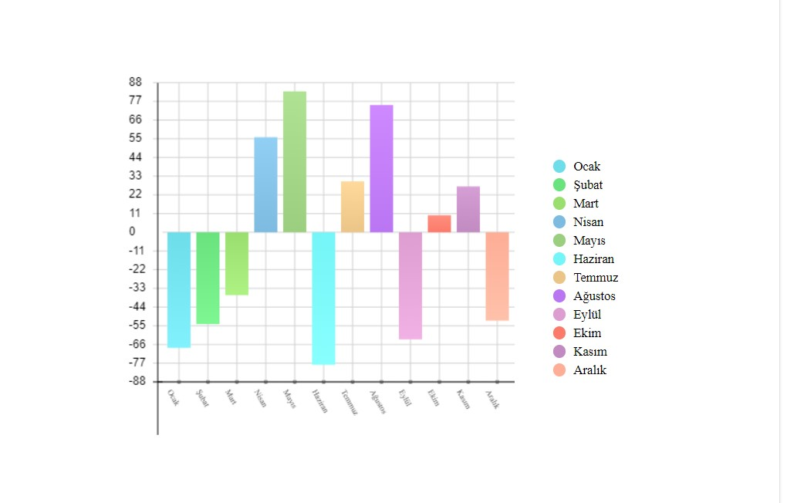

<a name="readme-top"></a>
<br />
<div align="center">
  <h3 align="center">GraphJS-React</h3>

  <p align="center">
    GraphJS-React provides you create graphs for your data.
  </p>
</div>


<!-- TABLE OF CONTENTS -->
<details>
  <summary>CONTENTS</summary>
  <ol>
    <li>
      <a href="#installation">Installation</a>
    </li>
    <li>
      <a href="#usage">Usage</a>
      <ul>
        <li><a href="#show-your-toast">Show Your Data On Graphs</a></li>
        <li><a href="#properties">Properties</a></li>
      </ul>
    </li>
    <li><a href="#built-with">Built With</a></li>
    <li><a href="#license">License</a></li>
  </ol>
</details>

### Installation

Follow the instructions to install GraphJS-React

```
$ npm install graphjs-react
```

<p align="right">(<a href="#readme-top">back to top</a>)</p>

## Usage

Add GraphJS-React CSS file to your index.js.
```jsx
import 'graphjs-react/index.css'
```

### Built With

[![React][React.js]][React-url]

<p align="right">(<a href="#readme-top">back to top</a>)</p>


<!-- LICENSE -->
## License

Distributed under the MIT License.

<p align="right">(<a href="#readme-top">back to top</a>)</p>

<!-- DOCUMANTATION -->
## Documantation


<details>
  <summary>Show Code</summary>
  ```cpp
 <BarChart
  height={400}
  onBarClick={() => {}}
  values={[
    {
      color: 'rgb(110,221,234)',
      x: 'Ocak',
      y: -68
    },
    {
      color: 'rgb(106,226,126)',
      x: 'Şubat',
      y: -54
    },
    {
      color: 'rgb(154,222,111)',
      x: 'Mart',
      y: -37
    },
    {
      color: 'rgb(126,187,225)',
      x: 'Nisan',
      y: 56
    },
    {
      color: 'rgb(156,206,128)',
      x: 'Mayıs',
      y: 83
    },
    {
      color: 'rgb(116,245,247)',
      x: 'Haziran',
      y: -78
    },
    {
      color: 'rgb(235,196,136)',
      x: 'Temmuz',
      y: 30
    },
    {
      color: 'rgb(186,117,243)',
      x: 'Ağustos',
      y: 75
    },
    {
      color: 'rgb(221,157,208)',
      x: 'Eylül',
      y: -63
    },
    {
      color: 'rgb(252,122,106)',
      x: 'Ekim',
      y: 10
    },
    {
      color: 'rgb(193,139,193)',
      x: 'Kasım',
      y: 27
    },
    {
      color: 'rgb(254,173,150)',
      x: 'Aralık',
      y: -52
    }
  ]}
  width={400}
/>
  ```
</details>
<!-- SOME VERSIONS INFO -->

<div>
 <b>1.0.0</b></br>
 <p>- </p>
</div>

