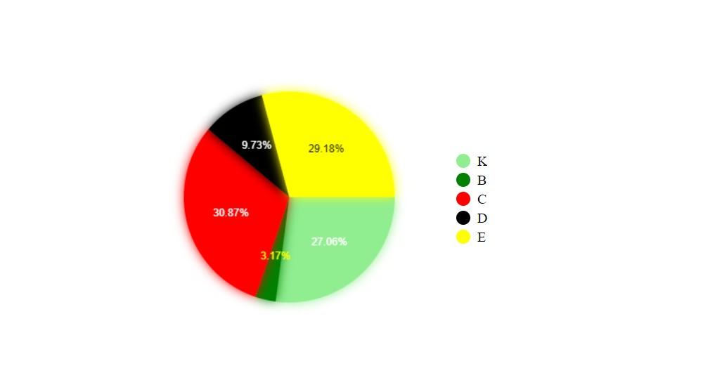

<a name="readme-top"></a>
<br />
<div align="center">
  <h3 align="center">GraphJS-React</h3>

  <p align="center">
    GraphJS-React provides you create graphs for your data.
  </p>
</div>


<!-- TABLE OF CONTENTS -->
<details>
  <summary>CONTENTS</summary>
  <ol>
    <li>
      <a href="#installation">Installation</a>
    </li>
    <li>
      <a href="#usage">Usage</a>
      <ul>
        <li><a href="#show-your-grap">Show Your Data On Graphs</a></li>
        <li><a href="#properties">Properties</a></li>
      </ul>
    </li>
    <li><a href="#built-with">Built With</a></li>
    <li><a href="#license">License</a></li>
  </ol>
</details>

### Installation

Follow the instructions to install GraphJS-React

```
$ npm install graphjs-react
```

<p align="right">(<a href="#readme-top">back to top</a>)</p>

## Usage

Add GraphJS-React CSS file to your index.js.
```jsx
import 'graphjs-react/index.css'
```

### Built With

[![React][React.js]][React-url]

<p align="right">(<a href="#readme-top">back to top</a>)</p>


<!-- LICENSE -->
## License

Distributed under the MIT License.

<p align="right">(<a href="#readme-top">back to top</a>)</p>

<!-- DOCUMANTATION -->
## Documantation
<h4>Bar Chart</h4>
<table class="docblock-argstable sb-unstyled css-v2ifgj">
<thead class="docblock-argstable-head"><tr><th><span>Name</span></th><th><span>Description</span></th><th><span>Default</span></th></tr></thead><tbody class="docblock-argstable-body"><tr><td class="css-4lbn0a"><span class="css-in3yi3">data</span><span title="Required" class="css-1ywjlcj">*</span></td><td><div class="css-1f9domv"><span class="css-o1d7ko">BarChartColumn[]</span></div></td><td><span>-</span></td></tr><tr><td class="css-4lbn0a"><span class="css-in3yi3">width</span></td><td><div class="css-1f9domv"><div class="css-13nzt7e"><span class="css-o1d7ko">number</span></div></div></td><td><div class="css-13nzt7e"><span class="css-o1d7ko">500</span></div></td></tr><tr><td class="css-4lbn0a"><span class="css-in3yi3">height</span></td><td><div class="css-1f9domv"><div class="css-13nzt7e"><span class="css-o1d7ko">number</span></div></div></td><td><div class="css-13nzt7e"><span class="css-o1d7ko">1200</span></div></td></tr><tr><td class="css-4lbn0a"><span class="css-in3yi3">onBarClick</span></td><td><div class="css-1f9domv"><span class="css-o1d7ko">(e: MouseEvent, item: BarChartColumn) =&gt; void</span></div></td><td><span>-</span></td></tr><tr><td class="css-4lbn0a"><span class="css-in3yi3">title</span></td><td><div class="css-1f9domv"><div class="css-13nzt7e"><span class="css-o1d7ko">TitleProps</span></div></div></td><td><span>-</span></td></tr><tr><td class="css-4lbn0a"><span class="css-in3yi3">containerStyle</span></td><td><div class="css-1f9domv"><div class="css-13nzt7e"><span class="css-o1d7ko">CSSProperties</span></div></div></td><td><span>-</span></td></tr><tr><td class="css-4lbn0a"><span class="css-in3yi3">labelStyle</span></td><td><div class="css-1f9domv"><div class="css-13nzt7e"><span class="css-o1d7ko">CSSProperties</span></div></div></td><td><span>-</span></td></tr><tr><td class="css-4lbn0a"><span class="css-in3yi3">roundValue</span></td><td><div class="css-1f9domv"><div class="css-13nzt7e"><span class="css-o1d7ko">number</span></div></div></td><td><span>-</span></td></tr><tr><td class="css-4lbn0a"><span class="css-in3yi3">range</span></td><td><div class="css-1f9domv"><div class="css-13nzt7e"><span class="css-o1d7ko">number</span><span class="css-o1d7ko">null</span></div></div></td><td><span>-</span></td></tr><tr><td class="css-4lbn0a"><span class="css-in3yi3">grid</span></td><td><div class="css-1f9domv"><div class="css-13nzt7e"><span class="css-o1d7ko">boolean</span></div></div></td><td><div class="css-13nzt7e"><span class="css-o1d7ko">true</span></div></td></tr><tr><td class="css-4lbn0a"><span class="css-in3yi3">rootStyle</span></td><td><div class="css-1f9domv"><div class="css-13nzt7e"><span class="css-o1d7ko">CSSProperties</span></div></div></td><td><span>-</span></td></tr><tr><td class="css-4lbn0a"><span class="css-in3yi3">graphStyle</span></td><td><div class="css-1f9domv"><div class="css-13nzt7e"><span class="css-o1d7ko">CSSProperties</span></div></div></td><td><span>-</span></td></tr><tr><td class="css-4lbn0a"><span class="css-in3yi3">backgroundColor</span></td><td><div class="css-1f9domv"><div class="css-13nzt7e"><span class="css-o1d7ko">string</span><span class="css-o1d7ko">null</span></div></div></td><td><div class="css-13nzt7e"><span class="css-o1d7ko">white</span></div></td></tr><tr><td class="css-4lbn0a"><span class="css-in3yi3">legend</span></td><td><div class="css-1f9domv"><div class="css-13nzt7e"><span class="css-o1d7ko">boolean</span></div></div></td><td><div class="css-13nzt7e"><span class="css-o1d7ko">true</span></div></td></tr><tr><td class="css-4lbn0a"><span class="css-in3yi3">labels</span></td><td><div class="css-1f9domv"><span class="css-o1d7ko">Omit&lt;LegendItemProps, "size"&gt;[]</span></div></td><td><span>-</span></td></tr><tr><td class="css-4lbn0a"><span class="css-in3yi3">titles</span></td><td><div class="css-1f9domv"><span class="css-o1d7ko">{ x: string; y: string; } | null</span></div></td><td><span>-</span></td></tr>
<tr><td class="css-4lbn0a"><span class="css-in3yi3">wheelScaling</span></td><td><div class="css-1f9domv"><div class="css-13nzt7e"><span class="css-o1d7ko">boolean</span></div></div></td><td><span>-</span></td></tr>
</tbody></table>

<details>
  <summary>Show Code</summary>
  
  ```typescript
 <BarChart
  height={400}
  onBarClick={() => {}}
  data={[
    {
      color: 'rgb(110,221,234)',
      x: 'Ocak',
      y: -68
    },
    {
      color: 'rgb(106,226,126)',
      x: 'Şubat',
      y: -54
    },
    {
      color: 'rgb(154,222,111)',
      x: 'Mart',
      y: -37
    },
    {
      color: 'rgb(126,187,225)',
      x: 'Nisan',
      y: 56
    },
    {
      color: 'rgb(156,206,128)',
      x: 'Mayıs',
      y: 83
    },
    {
      color: 'rgb(116,245,247)',
      x: 'Haziran',
      y: -78
    },
    {
      color: 'rgb(235,196,136)',
      x: 'Temmuz',
      y: 30
    },
    {
      color: 'rgb(186,117,243)',
      x: 'Ağustos',
      y: 75
    },
    {
      color: 'rgb(221,157,208)',
      x: 'Eylül',
      y: -63
    },
    {
      color: 'rgb(252,122,106)',
      x: 'Ekim',
      y: 10
    },
    {
      color: 'rgb(193,139,193)',
      x: 'Kasım',
      y: 27
    },
    {
      color: 'rgb(254,173,150)',
      x: 'Aralık',
      y: -52
    }
  ]}
  width={400}
    />
  ```
</details>
<h4>Funnel Chart</h4>
<table class="docblock-argstable sb-unstyled css-v2ifgj"><thead class="docblock-argstable-head"><tr><th><span>Name</span></th><th><span>Description</span></th><th><span>Default</span></th></tr></thead><tbody class="docblock-argstable-body"><tr><td class="css-4lbn0a"><span class="css-in3yi3">data</span><span title="Required" class="css-1ywjlcj">*</span></td><td><div class="css-1f9domv"><div class="css-13nzt7e"><span class="css-o1d7ko">FunnelChartData</span></div></div></td><td><span>-</span></td></tr><tr><td class="css-4lbn0a"><span class="css-in3yi3">width</span><span title="Required" class="css-1ywjlcj">*</span></td><td><div class="css-1f9domv"><div class="css-13nzt7e"><span class="css-o1d7ko">number</span></div></div></td><td><span>-</span></td></tr><tr><td class="css-4lbn0a"><span class="css-in3yi3">height</span><span title="Required" class="css-1ywjlcj">*</span></td><td><div class="css-1f9domv"><div class="css-13nzt7e"><span class="css-o1d7ko">number</span></div></div></td><td><span>-</span></td></tr><tr><td class="css-4lbn0a"><span class="css-in3yi3">options</span></td><td><div class="css-1f9domv"><div class="css-13nzt7e"><span class="css-o1d7ko">FunnelChartOptions</span></div></div></td><td><div class="css-c3junj"><div class="sbdocs-expandable css-dxn7z0"><span>object</span><svg viewBox="0 0 14 14" width="14px" height="14px" class="css-18fo1wt"><path d="m1.15 5.6 5.5 5.5c.2.2.5.2.7 0l5.5-5.5a.5.5 0 0 0-.7-.7L7 10.04 1.85 4.9a.5.5 0 1 0-.7.7Z"></path></svg></div></div></td></tr><tr><td class="css-4lbn0a"><span class="css-in3yi3">rootStyle</span></td><td><div class="css-1f9domv"><div class="css-13nzt7e"><span class="css-o1d7ko">CSSProperties</span></div></div></td><td><span>-</span></td></tr><tr><td class="css-4lbn0a"><span class="css-in3yi3">graphStyle</span></td><td><div class="css-1f9domv"><div class="css-13nzt7e"><span class="css-o1d7ko">CSSProperties</span></div></div></td><td><span>-</span></td></tr><tr><td class="css-4lbn0a"><span class="css-in3yi3">title</span></td><td><div class="css-1f9domv"><div class="css-13nzt7e"><span class="css-o1d7ko">TitleProps</span></div></div></td><td><span>-</span></td></tr><tr><td class="css-4lbn0a"><span class="css-in3yi3">backgroundColor</span></td><td><div class="css-1f9domv"><div class="css-13nzt7e"><span class="css-o1d7ko">string</span><span class="css-o1d7ko">null</span></div></div></td><td><div class="css-13nzt7e"><span class="css-o1d7ko">white</span></div></td></tr></tbody></table>


<details>
  <summary>Show Code</summary>
  
  ```typescript
<FunnelChart
  data={[
    {
      backgroundColor: 'lightgreen',
      name: 'K',
      value: 999
    },
    {
      backgroundColor: 'green',
      name: 'B',
      value: 168
    },
    {
      backgroundColor: 'yellow',
      name: 'E',
      value: 114
    },
    {
      backgroundColor: 'red',
      name: 'C',
      value: 93
    },
    {
      backgroundColor: 'black',
      name: 'D',
      value: 32
    }
  ]}
  height={500}
  width={500}
/>
  ```
</details>

<h4>Pie Char</h4>
<table class="docblock-argstable sb-unstyled css-v2ifgj"><thead class="docblock-argstable-head"><tr><th><span>Name</span></th><th><span>Description</span></th><th><span>Default</span></th></tr></thead><tbody class="docblock-argstable-body"><tr><td class="css-4lbn0a"><span class="css-in3yi3">data</span><span title="Required" class="css-1ywjlcj">*</span></td><td><div class="css-1f9domv"><span class="css-o1d7ko">ItemProps[]</span></div></td><td><span>-</span></td></tr><tr><td class="css-4lbn0a"><span class="css-in3yi3">onMouseClickPiece</span></td><td><div class="css-18q7sb7"><span class="css-o1d7ko">((e: MouseEvent, data: MouseEventData) =&gt; void)</span></div><table class="css-3nr4py"><tbody><tr><td><code>e</code></td><td>Mouseevent object</td></tr><tr><td><code>data</code></td><td>Clicked data which contains {
    root: ItemProps,
    name: string,
    angle: number,
    bgColor: string
}</td></tr></tbody></table></td><td><span>-</span></td></tr><tr><td class="css-4lbn0a"><span class="css-in3yi3">legend</span></td><td><div class="css-1f9domv"><div class="css-13nzt7e"><span class="css-o1d7ko">boolean</span></div></div></td><td><div class="css-13nzt7e"><span class="css-o1d7ko">false</span></div></td></tr><tr><td class="css-4lbn0a"><span class="css-in3yi3">radius</span></td><td><div class="css-1f9domv"><div class="css-13nzt7e"><span class="css-o1d7ko">number</span></div></div></td><td><div class="css-13nzt7e"><span class="css-o1d7ko">120</span></div></td></tr><tr><td class="css-4lbn0a"><span class="css-in3yi3">scaled</span></td><td><div class="css-1f9domv"><div class="css-13nzt7e"><span class="css-o1d7ko">boolean</span></div></div></td><td><div class="css-13nzt7e"><span class="css-o1d7ko">false</span></div></td></tr><tr><td class="css-4lbn0a"><span class="css-in3yi3">textToCenter</span></td><td><div class="css-1f9domv"><div class="css-13nzt7e"><span class="css-o1d7ko">boolean</span></div></div></td><td><div class="css-13nzt7e"><span class="css-o1d7ko">false</span></div></td></tr><tr><td class="css-4lbn0a"><span class="css-in3yi3">rootStyle</span></td><td><div class="css-1f9domv"><div class="css-13nzt7e"><span class="css-o1d7ko">CSSProperties</span></div></div></td><td><span>-</span></td></tr><tr><td class="css-4lbn0a"><span class="css-in3yi3">graphStyle</span></td><td><div class="css-1f9domv"><div class="css-13nzt7e"><span class="css-o1d7ko">CSSProperties</span></div></div></td><td><span>-</span></td></tr><tr><td class="css-4lbn0a"><span class="css-in3yi3">title</span></td><td><div class="css-1f9domv"><div class="css-13nzt7e"><span class="css-o1d7ko">TitleProps</span></div></div></td><td><span>-</span></td></tr><tr><td class="css-4lbn0a"><span class="css-in3yi3">backgroundColor</span></td><td><div class="css-1f9domv"><div class="css-13nzt7e"><span class="css-o1d7ko">string</span><span class="css-o1d7ko">null</span></div></div></td><td><div class="css-13nzt7e"><span class="css-o1d7ko">white</span></div></td></tr><tr><td class="css-4lbn0a"><span class="css-in3yi3">labels</span></td><td><div class="css-1f9domv"><span class="css-o1d7ko">Omit&lt;LegendItemProps, "size"&gt;[]</span></div></td><td><span>-</span></td></tr><tr><td class="css-4lbn0a"><span class="css-in3yi3">titles</span></td><td><div class="css-1f9domv"><span class="css-o1d7ko">{ x: string; y: string; } | null</span></div></td><td><span>-</span></td></tr><tr><td class="css-4lbn0a"><span class="css-in3yi3">doughnut</span></td><td><div class="css-1f9domv"><div class="css-13nzt7e"><span class="css-o1d7ko">boolean</span></div></div></td><td><div class="css-13nzt7e"><span class="css-o1d7ko">false</span></div></td></tr></tbody></table>

<details>
<summary>Show Code</summary>
  
```typescript
  <Pie
  data={[
    {
      backgroundColor: 'lightgreen',
      name: 'K',
      textColor: 'white',
      value: 136
    },
    {
      backgroundColor: 'green',
      name: 'B',
      textColor: 'yellow',
      value: 85
    },
    {
      backgroundColor: 'red',
      name: 'C',
      textColor: 'white',
      value: 53
    },
    {
      backgroundColor: 'black',
      name: 'D',
      textColor: 'white',
      value: 22
    },
    {
      backgroundColor: 'yellow',
      name: 'E',
      textColor: 'black',
      value: 30
    }
  ]}
  legend
  onMouseClickPiece={() => {}}
/>
```
</details>
<h4>Line Chart</h4>
<table class="docblock-argstable sb-unstyled css-v2ifgj"><thead class="docblock-argstable-head"><tr><th><span>Name</span></th><th><span>Description</span></th><th><span>Default</span></th></tr></thead><tbody class="docblock-argstable-body"><tr><td class="css-4lbn0a"><span class="css-in3yi3">data</span><span title="Required" class="css-1ywjlcj">*</span></td><td><div class="css-1f9domv"><span class="css-o1d7ko">ChartColumn[] | ChartColumn[][]</span></div></td><td><span>-</span></td></tr><tr><td class="css-4lbn0a"><span class="css-in3yi3">width</span></td><td><div class="css-1f9domv"><div class="css-13nzt7e"><span class="css-o1d7ko">number</span></div></div></td><td><div class="css-13nzt7e"><span class="css-o1d7ko">500</span></div></td></tr><tr><td class="css-4lbn0a"><span class="css-in3yi3">height</span></td><td><div class="css-1f9domv"><div class="css-13nzt7e"><span class="css-o1d7ko">number</span></div></div></td><td><div class="css-13nzt7e"><span class="css-o1d7ko">1200</span></div></td></tr><tr><td class="css-4lbn0a"><span class="css-in3yi3">labels</span></td><td><div class="css-1f9domv"><span class="css-o1d7ko">Omit&lt;LegendItemProps, "size"&gt;[]</span></div></td><td><span>-</span></td></tr><tr><td class="css-4lbn0a"><span class="css-in3yi3">title</span></td><td><div class="css-1f9domv"><div class="css-13nzt7e"><span class="css-o1d7ko">TitleProps</span></div></div></td><td><span>-</span></td></tr><tr><td class="css-4lbn0a"><span class="css-in3yi3">titles</span></td><td><div class="css-1f9domv"><span class="css-o1d7ko">{ x: string; y: string; } | null</span></div></td><td><span>-</span></td></tr><tr><td class="css-4lbn0a"><span class="css-in3yi3">xAxisLabels</span></td><td><div class="css-1f9domv"><span class="css-o1d7ko">string[]</span></div></td><td><span>-</span></td></tr><tr><td class="css-4lbn0a"><span class="css-in3yi3">containerStyle</span></td><td><div class="css-1f9domv"><div class="css-13nzt7e"><span class="css-o1d7ko">CSSProperties</span></div></div></td><td><span>-</span></td></tr><tr><td class="css-4lbn0a"><span class="css-in3yi3">labelStyle</span></td><td><div class="css-1f9domv"><div class="css-13nzt7e"><span class="css-o1d7ko">CSSProperties</span></div></div></td><td><span>-</span></td></tr><tr><td class="css-4lbn0a"><span class="css-in3yi3">roundValue</span></td><td><div class="css-1f9domv"><div class="css-13nzt7e"><span class="css-o1d7ko">number</span></div></div></td><td><span>-</span></td></tr><tr><td class="css-4lbn0a"><span class="css-in3yi3">range</span></td><td><div class="css-1f9domv"><div class="css-13nzt7e"><span class="css-o1d7ko">number</span><span class="css-o1d7ko">null</span></div></div></td><td><span>-</span></td></tr><tr><td class="css-4lbn0a"><span class="css-in3yi3">grid</span></td><td><div class="css-1f9domv"><div class="css-13nzt7e"><span class="css-o1d7ko">boolean</span></div></div></td><td><div class="css-13nzt7e"><span class="css-o1d7ko">true</span></div></td></tr><tr><td class="css-4lbn0a"><span class="css-in3yi3">wheelScaling</span></td><td><div class="css-1f9domv"><div class="css-13nzt7e"><span class="css-o1d7ko">boolean</span></div></div></td><td><span>-</span></td></tr><tr><td class="css-4lbn0a"><span class="css-in3yi3">rootStyle</span></td><td><div class="css-1f9domv"><div class="css-13nzt7e"><span class="css-o1d7ko">CSSProperties</span></div></div></td><td><span>-</span></td></tr><tr><td class="css-4lbn0a"><span class="css-in3yi3">graphStyle</span></td><td><div class="css-1f9domv"><div class="css-13nzt7e"><span class="css-o1d7ko">CSSProperties</span></div></div></td><td><span>-</span></td></tr><tr><td class="css-4lbn0a"><span class="css-in3yi3">backgroundColor</span></td><td><div class="css-1f9domv"><div class="css-13nzt7e"><span class="css-o1d7ko">string</span><span class="css-o1d7ko">null</span></div></div></td><td><div class="css-13nzt7e"><span class="css-o1d7ko">white</span></div></td></tr><tr><td class="css-4lbn0a"><span class="css-in3yi3">legend</span></td><td><div class="css-1f9domv"><div class="css-13nzt7e"><span class="css-o1d7ko">boolean</span></div></div></td><td><div class="css-13nzt7e"><span class="css-o1d7ko">true</span></div></td></tr><tr><td class="css-4lbn0a"><span class="css-in3yi3">onPointOver</span></td><td><div class="css-1f9domv"><span class="css-o1d7ko">((e: MouseEvent, item: ChartPointItem) =&gt; void)</span></div></td><td><span>-</span></td></tr><tr><td class="css-4lbn0a"><span class="css-in3yi3">onPointClick</span></td><td><div class="css-1f9domv"><span class="css-o1d7ko">((e: MouseEvent, item: ChartPointItem) =&gt; void)</span></div></td><td><span>-</span></td></tr></tbody></table>


<details>
  <summary>Show Code</summary>
  
  ```typescript
 <LineChart
  data={[
    [
      {
        color: 'rgb(119,219,103)',
        x: '2005',
        y: 34752098
      },
      {
        color: 'rgb(198,199,182)',
        x: '2006',
        y: 32487921
      },
      {
        color: 'rgb(187,183,118)',
        x: '2007',
        y: 53719722
      },
      {
        color: 'rgb(162,237,225)',
        x: '2008',
        y: 65884386
      },
      {
        color: 'rgb(153,122,222)',
        x: '2009',
        y: 50304302
      },
      {
        color: 'rgb(251,126,251)',
        x: '2010',
        y: 88975899
      }
    ],
    [
      {
        color: 'rgb(122,111,103)',
        x: '2005',
        y: 85404004
      },
      {
        color: 'rgb(241,254,214)',
        x: '2006',
        y: 44951584
      },
      {
        color: 'rgb(168,145,111)',
        x: '2007',
        y: 66770171
      },
      {
        color: 'rgb(172,186,236)',
        x: '2008',
        y: 88406893
      },
      {
        color: 'rgb(168,242,195)',
        x: '2009',
        y: 30232527
      },
      {
        color: 'rgb(237,119,101)',
        x: '2010',
        y: 17022190
      }
    ]
  ]}
  height={400}
  labels={[
    {
      color: 'blue',
      name: 'A'
    },
    {
      color: 'red',
      name: 'B'
    }
  ]}
  onPointClick={() => {}}
  onPointOver={() => {}}
  title={{
    label: 'Countries\' Populations'
  }}
  titles={{
    x: 'Year',
    y: 'Population'
  }}
  width={400}
  xAxisLabels={[
    '2005',
    '2002',
    '2006',
    '2007',
    '2008',
    '2009',
    '2010'
  ]}
/>
  ```
</details>


<details>
  <summary>Show Code</summary>
  
  ```typescript
 <LineChart
  data={[
    [
      {
        x: -35,
        y: 1225
      },
      {
        x: -34,
        y: 1156
      },
      {
        x: -33,
        y: 1089
      },
      {
        x: -32,
        y: 1024
      },
      {
        x: -31,
        y: 961
      },
      {
        x: -30,
        y: 900
      },
      {
        x: -29,
        y: 841
      },
      {
        x: -28,
        y: 784
      },
      {
        x: -27,
        y: 729
      },
      {
        x: -26,
        y: 676
      },
      {
        x: -25,
        y: 625
      },
      {
        x: -24,
        y: 576
      },
      {
        x: -23,
        y: 529
      },
      {
        x: -22,
        y: 484
      },
      {
        x: -21,
        y: 441
      },
      {
        x: -20,
        y: 400
      },
      {
        x: -19,
        y: 361
      },
      {
        x: -18,
        y: 324
      },
      {
        x: -17,
        y: 289
      },
      {
        x: -16,
        y: 256
      },
      {
        x: -15,
        y: 225
      },
      {
        x: -14,
        y: 196
      },
      {
        x: -13,
        y: 169
      },
      {
        x: -12,
        y: 144
      },
      {
        x: -11,
        y: 121
      },
      {
        x: -10,
        y: 100
      },
      {
        x: -9,
        y: 81
      },
      {
        x: -8,
        y: 64
      },
      {
        x: -7,
        y: 49
      },
      {
        x: -6,
        y: 36
      },
      {
        x: -5,
        y: 25
      },
      {
        x: -4,
        y: 16
      },
      {
        x: -3,
        y: 9
      },
      {
        x: -2,
        y: 4
      },
      {
        x: -1,
        y: 1
      },
      {
        x: 0,
        y: 0
      },
      {
        x: 0,
        y: 0
      },
      {
        x: 1,
        y: 1
      },
      {
        x: 2,
        y: 4
      },
      {
        x: 3,
        y: 9
      },
      {
        x: 4,
        y: 16
      },
      {
        x: 5,
        y: 25
      },
      {
        x: 6,
        y: 36
      },
      {
        x: 7,
        y: 49
      },
      {
        x: 8,
        y: 64
      },
      {
        x: 9,
        y: 81
      },
      {
        x: 10,
        y: 100
      },
      {
        x: 11,
        y: 121
      },
      {
        x: 12,
        y: 144
      },
      {
        x: 13,
        y: 169
      },
      {
        x: 14,
        y: 196
      },
      {
        x: 15,
        y: 225
      },
      {
        x: 16,
        y: 256
      },
      {
        x: 17,
        y: 289
      },
      {
        x: 18,
        y: 324
      },
      {
        x: 19,
        y: 361
      },
      {
        x: 20,
        y: 400
      },
      {
        x: 21,
        y: 441
      },
      {
        x: 22,
        y: 484
      },
      {
        x: 23,
        y: 529
      },
      {
        x: 24,
        y: 576
      },
      {
        x: 25,
        y: 625
      },
      {
        x: 26,
        y: 676
      },
      {
        x: 27,
        y: 729
      },
      {
        x: 28,
        y: 784
      },
      {
        x: 29,
        y: 841
      },
      {
        x: 30,
        y: 900
      },
      {
        x: 31,
        y: 961
      },
      {
        x: 32,
        y: 1024
      },
      {
        x: 33,
        y: 1089
      },
      {
        x: 34,
        y: 1156
      },
      {
        x: 35,
        y: 1225
      }
    ],
    [
      {
        x: -35,
        y: 1319
      },
      {
        x: -34,
        y: 1246
      },
      {
        x: -33,
        y: 1175
      },
      {
        x: -32,
        y: 1106
      },
      {
        x: -31,
        y: 1039
      },
      {
        x: -30,
        y: 974
      },
      {
        x: -29,
        y: 911
      },
      {
        x: -28,
        y: 850
      },
      {
        x: -27,
        y: 791
      },
      {
        x: -26,
        y: 734
      },
      {
        x: -25,
        y: 679
      },
      {
        x: -24,
        y: 626
      },
      {
        x: -23,
        y: 575
      },
      {
        x: -22,
        y: 526
      },
      {
        x: -21,
        y: 479
      },
      {
        x: -20,
        y: 434
      },
      {
        x: -19,
        y: 391
      },
      {
        x: -18,
        y: 350
      },
      {
        x: -17,
        y: 311
      },
      {
        x: -16,
        y: 274
      },
      {
        x: -15,
        y: 239
      },
      {
        x: -14,
        y: 206
      },
      {
        x: -13,
        y: 175
      },
      {
        x: -12,
        y: 146
      },
      {
        x: -11,
        y: 119
      },
      {
        x: -10,
        y: 94
      },
      {
        x: -9,
        y: 71
      },
      {
        x: -8,
        y: 50
      },
      {
        x: -7,
        y: 31
      },
      {
        x: -6,
        y: 14
      },
      {
        x: -5,
        y: -1
      },
      {
        x: -4,
        y: -14
      },
      {
        x: -3,
        y: -25
      },
      {
        x: -2,
        y: -34
      },
      {
        x: -1,
        y: -41
      },
      {
        x: 0,
        y: -46
      },
      {
        x: 0,
        y: -46
      },
      {
        x: 1,
        y: -49
      },
      {
        x: 2,
        y: -50
      },
      {
        x: 3,
        y: -49
      },
      {
        x: 4,
        y: -46
      },
      {
        x: 5,
        y: -41
      },
      {
        x: 6,
        y: -34
      },
      {
        x: 7,
        y: -25
      },
      {
        x: 8,
        y: -14
      },
      {
        x: 9,
        y: -1
      },
      {
        x: 10,
        y: 14
      },
      {
        x: 11,
        y: 31
      },
      {
        x: 12,
        y: 50
      },
      {
        x: 13,
        y: 71
      },
      {
        x: 14,
        y: 94
      },
      {
        x: 15,
        y: 119
      },
      {
        x: 16,
        y: 146
      },
      {
        x: 17,
        y: 175
      },
      {
        x: 18,
        y: 206
      },
      {
        x: 19,
        y: 239
      },
      {
        x: 20,
        y: 274
      },
      {
        x: 21,
        y: 311
      },
      {
        x: 22,
        y: 350
      },
      {
        x: 23,
        y: 391
      },
      {
        x: 24,
        y: 434
      },
      {
        x: 25,
        y: 479
      },
      {
        x: 26,
        y: 526
      },
      {
        x: 27,
        y: 575
      },
      {
        x: 28,
        y: 626
      },
      {
        x: 29,
        y: 679
      },
      {
        x: 30,
        y: 734
      },
      {
        x: 31,
        y: 791
      },
      {
        x: 32,
        y: 850
      },
      {
        x: 33,
        y: 911
      },
      {
        x: 34,
        y: 974
      },
      {
        x: 35,
        y: 1039
      }
    ]
  ]}
  height={400}
  labels={[
    {
      color: 'blue',
      name: 'A'
    },
    {
      color: 'red',
      name: 'B'
    }
  ]}
  onPointClick={() => {}}
  onPointOver={() => {}}
  titles={{
    x: 'X',
    y: 'Y'
  }}
  width={400}
/>
  ```
</details>


  
<!-- INTERFACES -->

## Interfaces

```typescript
interface ChartColumn {
  y: string | number,
  x: string | number,
  color?: string, 
}
```

```typescript
interface TitleProps{
    label:string,
    style?:CSSProperties
}
```

```typescript
interface ContextChartXY {
  context: CanvasRenderingContext2D | null
  maxItemWidth: number
}
```

```typescript
interface LegendItemProps {
    name: string,
    color: string,
    size?: number
}
```

```typescript
interface ChartPointItem extends ChartColumn{
    root:LegendItemProps
}
```

```typescript
interface LineChartProps{
    onPointOver?:(e:MouseEvent,item:ChartPointItem)=>void,
    onPointClick?:(e:MouseEvent,item:ChartPointItem)=>void
} 
```

```typescript
interface ItemProps {
    /**
     * @description The value of item
     */
    value: number,
    /**
     * @description item name
     */
    name: string,
    /**
     * @description specify a color for background
     */
    backgroundColor: string,
    /**
     * @description text color, It was excluded from Funnel Chart
     */
    textColor?: string
}
```

```typescript
interface FunnelChartOptions{
    /**
     * @description high value bg gradient color
     * @default #00308F
     */
    highBarColor:string,
     /**
     * @description low value bg gradient color
     * @default gray
     */
    lowBarColor:string,
     /**
     * @description inline text color
     * @default lightgray
     */
    barInlineTextColor:string,
     /**
     * @description label text color
     * @default black
     */
    labelTextColor:string
}
```

Notes for 1.0.2

<ul>
 <li>Fixed bar chart number zero problem</li>
 <li>Changed barchar values property name to data</li>
</ul>

Notes for 1.0.3

<ul>
 <li>Fixed going x axis to right when adding x and y labels</li>
 <li>Added Line Chart</li>
</ul>
